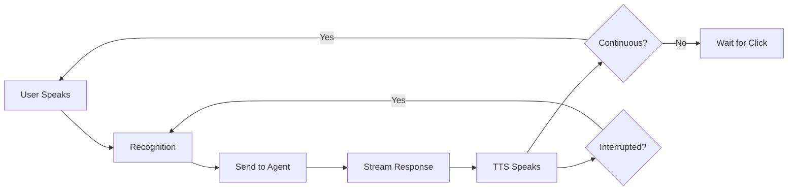

# 🎤 Voice Assistant with LangChain & Databricks

A production-ready voice assistant built with LangChain, Databricks Apps, and real-time streaming capabilities. Follows the [LangChain Voice Agent architecture](https://python.langchain.com/docs/voice-agent) using the "sandwich" pattern: Speech-to-Text → Agent → Text-to-Speech.

## ✨ Features

* **🎙️ Real-time Voice Input** - Browser-based speech recognition with automatic transcription
* **🔊 Automatic Voice Output** - Natural voice responses using Web Speech API
* **⚡ Streaming Responses** - See and hear responses as they're generated
* **🤝 Hands-free Conversation** - No manual "Send" button required
* **🎯 Voice Interruption** - Speak anytime to interrupt the assistant (truly natural conversations!)
* **🔄 Continuous Mode** - Automatic back-and-forth conversations without button clicks
* **🛑 Stop Words** - Say "stop", "exit", or "quit" to end conversations naturally
* **💬 Conversation Memory** - Context-aware multi-turn conversations with history truncation
* **🧠 Powered by Databricks** - Uses `databricks-qwen3-next-80b-a3b-instruct` foundation model
* **📊 MLflow Tracing** - Full observability with voice-specific metrics (first token latency, tokens/sec)
* **🌐 WebSocket Streaming** - Real-time bidirectional communication
* **⚙️ Adjustable Sensitivity** - Tune voice interruption thresholds for your environment
* **🐛 Debug Mode** - Real-time detection logging to optimize performance

## 📁 Project Structure

```
voice_app/v2/
├── app.py                      # FastAPI WebSocket server with embedded HTML UI
├── agent.py                    # LangChain agent backend with async streaming
├── app.yaml                    # Databricks Apps configuration (FastAPI/uvicorn)
├── requirements.txt            # Python dependencies
├── README.md                   # This file
└── VOICE_ARCHITECTURE.md       # Detailed architecture documentation
```

## 🏗️ Architecture

### Overview

This implementation follows the **LangChain "Sandwich" Architecture** for voice agents:

```
Browser (Client)                    Server (Python)
─────────────────────────────────   ───────────────────────────────
Speech Recognition API              FastAPI WebSocket
        ↓                                   ↓
    Transcript                         LangChain Agent
        ↓                                   ↓
    WebSocket ────────────────────→   Stream Response Chunks
        ↓                                   ↓
    Display Text                       (Async Generator)
        ↓                                   ↓
Speech Synthesis API ←─────────────  Complete Response
        ↓
    Audio Output
        ↓
Background Recognition (for interruption)
```

### Components

#### 1. Frontend (Embedded HTML/JavaScript)
* **Web Speech API** - Browser-native speech recognition and synthesis
* **Dual Recognition System** - Main for input + background for interruption detection
* **WebSocket Client** - Maintains persistent connection for real-time streaming
* **Automatic Flow** - No manual buttons between voice input and agent processing
* **Real-time UI Updates** - Displays streaming text as it arrives
* **Voice Interruption** - Detects when user speaks during assistant response

#### 2. Backend (FastAPI + LangChain)
* **FastAPI WebSocket Server** - Handles real-time bidirectional communication
* **LangChain Agent** - Async streaming with conversation history management
* **ChatDatabricks** - Latest `databricks-langchain` package integration
* **MLflow Tracing** - Tracks latency metrics and conversation quality

#### 3. Voice Optimizations
* **History Truncation** - Keeps only last 10 turns (20 messages) to reduce latency
* **First Token Latency** - Targets < 500ms for natural conversation
* **Streaming Chunks** - Immediate yielding for real-time feel
* **Voice-Optimized Prompts** - 2-4 sentence responses, no markdown/code blocks
* **Interruption Word Preservation** - Captures and prepends detected words during interruption

### Data Flow (Continuous Mode)

```
1. User clicks 🎤 or enables Continuous Mode
2. Browser Speech Recognition → Transcript
3. WebSocket → Send transcript to server
4. LangChain Agent → Stream response chunks
5. WebSocket → Send chunks to client
6. Browser → Display text + Speak audio
7. Background Recognition → Listen for interruption
8. If user speaks → Interrupt + capture words
9. Repeat automatically (truly hands-free!)
```

**Key difference from traditional chatbots:** Fully automatic flow with natural interruption support, just like talking to a human.

## 🚀 Quick Start

### Prerequisites

* Databricks workspace with Apps enabled
* Access to foundation model APIs (`databricks-qwen3-next-80b-a3b-instruct`)
* Modern browser with Web Speech API support (Chrome/Edge recommended)
* **Headphones recommended** - Prevents echo during voice interruption

### Local Development

1. **Set up environment:**

```bash
# Set Databricks credentials
export DATABRICKS_HOST="https://your-workspace.cloud.databricks.com"
export DATABRICKS_TOKEN="dapi..."

# Install dependencies
pip install -r requirements.txt
```

2. **Run locally:**

```bash
# Start FastAPI server
uvicorn app:app --host 0.0.0.0 --port 8000

# Open browser
open http://localhost:8000
```

3. **Test the agent separately:**

```python
import asyncio
from agent import VoiceAgent

async def test():
    agent = VoiceAgent()
    async for chunk in agent.stream_response("Hello!"):
        print(chunk, end="", flush=True)

asyncio.run(test())
```

### Deploy to Databricks Apps

The app is configured to run with FastAPI + uvicorn via `app.yaml`.

#### Option 1: Using Databricks CLI

```bash
# Install/update CLI
pip install databricks-cli --upgrade

# Configure workspace
databricks configure --token

# Deploy app
databricks apps deploy voice-assistant \
  --source-code-path /Users/your.email@company.com/GenAI/voice_app/v2
```

#### Option 2: Using the UI

1. Navigate to **Workspace** → **Apps**
2. Click **Create App**
3. Name: `voice-assistant`
4. Source: Select the `voice_app/v2` folder
5. Click **Create**
6. Monitor deployment logs (should show "Uvicorn running on...")

#### Option 3: Using Databricks Asset Bundles

Create `databricks.yml` in your project root:

```yaml
bundle:
  name: voice-assistant

resources:
  apps:
    voice_assistant:
      name: voice-assistant
      source_code_path: ./voice_app/v2
```

Deploy:
```bash
databricks bundle deploy
```

## 📖 Usage

### Voice Interaction Modes

#### Standard Mode (Click-to-Talk)

1. **Click 🎤** - Start voice recording
2. **Speak naturally** - Ask your question
3. **Automatic processing** - Recognition stops when you pause
4. **Response arrives** - Text streams in + voice speaks automatically
5. **Interrupt anytime** - Just start speaking to interrupt the assistant
6. **Continue conversation** - Click 🎤 again when ready

#### Continuous Mode (Fully Hands-Free)

1. **Enable "🔄 Continuous Mode"** - One-time toggle
2. **Speak your question** - No need to click anything
3. **Assistant responds** - Automatic voice output
4. **Keep talking** - Listening resumes automatically after each response
5. **End conversation** - Say "stop", "exit", or "quit"

**Perfect for:** Long conversations, accessibility, hands-free scenarios

### Voice Interruption (Natural Conversations)

**The assistant can be interrupted mid-response, just like talking to a human!**

#### How It Works

1. **Assistant starts speaking** → Background recognition activates
2. **You start speaking** → System detects your voice (3+ words)
3. **Instant interruption** → Assistant stops immediately
4. **Words preserved** → Your interruption words are captured
5. **Continue naturally** → Speak the rest of your thought

#### Example Flow

```
Assistant: "The capital of France is Paris, which is known for..."
You: "Wait, what about Germany?" 
        ↑
   (Interrupts automatically, "Wait, what about Germany?" is captured)
   
Assistant stops immediately, you can continue: "What's the capital of Germany?"
Final input: "Wait, what about Germany? What's the capital of Germany?"
```

#### Tuning Interruption Sensitivity

If interruption is too sensitive or not responsive:

1. **Enable Debug Mode** - Check "Show Debug Info" to see real-time detection
2. **Adjust Min Words** - Slider from 1-10 words (default: 3)
   * Lower = More sensitive (interrupts faster)
   * Higher = Less false positives (more stable)
3. **Adjust Delay** - Slider from 300-2000ms (default: 700ms)
   * Lower = Faster interruption response
   * Higher = Avoids echo detection
4. **Use Headphones** - Prevents assistant's voice from triggering false interruptions

**Debug output shows:**
```
[2:30:15 PM] Detected: "wait a minute" (3 words, conf: 0.78)
[2:30:15 PM] ✅ INTERRUPTING with: "wait a minute"
[2:30:15 PM] TTS stopped (interrupted)
[2:30:15 PM] Main recognition started
```

### Stop Words

End conversations naturally by saying:
* "stop"
* "exit"
* "quit"
* "goodbye"
* "bye bye"
* "end conversation"

The system will detect these and gracefully end the continuous conversation mode.


### Voice Interruption Technical Details

**Recent Improvements:** Four major fixes implemented to ensure robust, natural interruption handling:

#### Fix #1: Echo/False Interruptions from TTS ✅

**Problem:** Background recognition detected assistant's own voice as user interruption (e.g., "thank you how" from assistant TTS)

**Solution:**
* Increased confidence threshold: **0.5 → 0.75**
* Increased initial delay: **700ms → 1200ms** (configurable)
* Increased min words: **2 → 3 words** (default)
* Added echo detection: Compares detected text with recent TTS output
* Filters if detected text matches >70% of TTS words

**Key Variables:**
```javascript
let interruptionDelay = 1200;      // Configurable via slider (800-2000ms)
let lastTTSText = '';              // Stores recent TTS for comparison
```

#### Fix #2: Incomplete Phrase Capture ✅

**Problem:** System captured "what do you" but missed "think about AI" — only first 3 words detected instead of full phrase

**Root Cause:** Early return in `backgroundRecognition.onresult` blocked further text accumulation after trigger

**Solution:**
* **Removed blocking check** from `onresult` handler
* Background recognition **continues accumulating** during 500ms trigger window
* Timer prevents duplicate triggers while allowing phrase completion
* Captures full phrase: "what do you think about AI" ✅

**Key Variables:**
```javascript
let backgroundAccumulatedText = '';   // Accumulates ALL detected words
let interruptionTriggerTimer = null;  // 500ms window for phrase completion
```

#### Fix #3: Auto-Submit After Interruption ✅

**Problem:** After capturing interruption, if user didn't speak within 2 seconds, system showed "No speech detected" instead of submitting captured text

**Solution:**
* Added `interruptionAutoSubmitTimer` (2-second timeout)
* Starts when main recognition begins after interruption
* If timer fires and `interruptionTranscript` exists, calls `recognition.stop()` to submit
* `recognition.onend` checks for `interruptionTranscript` even when `currentTranscript` is empty

**Key Variables:**
```javascript
let interruptionAutoSubmitTimer = null;  // 2-second auto-submit timer
```

#### Fix #4: Transcript Duplication Bug ✅

**Problem:** Words repeated in final message: "in what countries does **in what countries does** tell me everything"

**Root Cause:** `interruptionTranscript` added **twice**:
1. In `onresult`: `currentTranscript = interruptionTranscript + ' ' + newSpeech`
2. In `onend`: `combinedText = interruptionTranscript + ' ' + currentTranscript`

**Solution:**
* `currentTranscript` now stores **ONLY new speech** (line 541)
* Combination happens **exactly once** in `onend` (line 590)
* Result: Clean, non-duplicated messages ✅

**Before:**
```javascript
// onresult - WRONG!
currentTranscript = interruptionTranscript + ' ' + newSpeech;

// onend - Adds interruption AGAIN
combinedText = interruptionTranscript + ' ' + currentTranscript;
// Result: "in what countries does in what countries does tell me"
```

**After:**
```javascript
// onresult - Store ONLY new speech
currentTranscript = finalTranscript || interimTranscript;

// onend - Combine ONCE
const combinedText = (interruptionTranscript + ' ' + currentTranscript).trim();
// Result: "in what countries does tell me everything" ✅
```

### Complete Interruption Flow (After All Fixes)

1. **User interrupts during TTS:** "what do you think about AI"
2. **Background recognition** (after 1200ms delay):
   * Detects 3+ words → starts 500ms timer
   * **Continues listening** during timer (no blocking)
   * Accumulates full phrase in `backgroundAccumulatedText`
3. **After 500ms:** Calls `handleVoiceInterruption(fullPhrase)`
4. **Main recognition starts**:
   * Shows: "Interrupted with: 'what do you think about AI'"
   * Hint: "Continue speaking or wait 2 seconds to submit"
   * Sets 2-second auto-submit timer
5. **Two paths:**
   * **User continues:** Timer cancelled, new speech added to `currentTranscript`
   * **User silent 2s:** Timer fires, calls `recognition.stop()`
6. **recognition.onend:**
   * **Combines once:** `combinedText = interruptionTranscript + ' ' + currentTranscript`
   * Submits combined text (interruption + continuation, or just interruption)

### Configurable Settings

| Setting | Default | Range | Purpose |
|---------|---------|-------|---------|
| **Min Words** | 3 | 2-10 | Words needed to trigger interruption |
| **Detection Delay** | 1200ms | 800-2000ms | Initial delay to avoid TTS echo |
| **Auto-Submit** | 2000ms | Fixed | Timeout for continuing speech |
| **Confidence** | 0.75 | Fixed | Min confidence to accept detection |
| **Capture Window** | 500ms | Fixed | Extra time to complete phrase |

### Debug Mode

Enable "Show Debug Info" checkbox to see:
* Detection events with word count and confidence
* Echo filtering events  
* Timer events (trigger, cancel, auto-submit)
* Combined text before submission

### Best Practices

✅ **DO:**
* Use headphones to minimize TTS echo
* Speak clearly with 3+ words to interrupt
* Enable debug mode when tuning sensitivity
* Adjust delay slider if experiencing false triggers

❌ **DON'T:**
* Use laptop speakers (causes echo and false triggers)
* Set min words too low (< 2 increases false positives)
* Set delay too short (< 1000ms may detect TTS echo)

### Controls

* **🔄 Continuous Mode: ON/OFF** - Enable fully hands-free conversation
* **🎙️ Voice Interrupt: ON/OFF** - Toggle voice-based interruption
* **🔊 Auto-Speak: ON/OFF** - Toggle automatic voice responses
* **🗑️ Clear Chat** - Reset conversation history
* **Status indicators** - Visual feedback for listening/speaking/interrupting states

### Browser Compatibility

| Browser | Speech Recognition | Speech Synthesis | Voice Interrupt | Overall |
|---------|-------------------|------------------|-----------------|---------|
| Chrome | ✅ Full support | ✅ Full support | ✅ Works well | ✅ **Recommended** |
| Edge | ✅ Full support | ✅ Full support | ✅ Works well | ✅ **Recommended** |
| Safari | ✅ Full support | ✅ Full support | ⚠️ May need tuning | ✅ Works |
| Firefox | ⚠️ Limited | ✅ Full support | ❌ Not supported | ⚠️ Use text fallback |

**Note:** 
- Speech Recognition requires HTTPS in production. Databricks Apps provides HTTPS by default.
- **Headphones highly recommended** for voice interruption to prevent echo feedback
- Background recognition (for interruption) requires continuous microphone access

## ⚙️ Configuration

### Model Selection

Edit `agent.py` to change the foundation model:

```python
agent = VoiceAgent(
    model_endpoint="databricks-meta-llama-3-3-70b-instruct",  # Change here
    temperature=0.7,
    max_tokens=1000
)
```

Available Databricks Foundation Models:
* `databricks-qwen3-next-80b-a3b-instruct` (default, recommended for voice)
* `databricks-meta-llama-3-3-70b-instruct`
* `databricks-gpt-5-mini`
* `databricks-claude-sonnet-4-6`

### Voice Optimization Parameters

Adjust in `agent.py`:

```python
agent = VoiceAgent(
    max_history_turns=10,        # Conversation memory (default: 10 turns)
    temperature=0.7,              # Response creativity (0-1)
    max_tokens=1000,              # Max response length
    system_prompt="Custom prompt..." # Override default personality
)
```

**Voice-specific tuning:**
* Lower `max_history_turns` (5-10) for faster responses
* Keep `max_tokens` moderate (500-1000) for natural speech length
* Use conversational system prompts (avoid technical jargon)

### Voice Interruption Settings

Adjust thresholds in the UI or modify defaults in `app.py`:

```javascript
// In the HTML_CONTENT JavaScript section
let minWordsToInterrupt = 3;     // Minimum words to trigger interruption
let interruptionDelay = 700;     // ms delay before listening for interruption
let interruptionCooldown = 2000; // ms between allowed interruptions
```

**Recommendations by environment:**
* **Quiet room + headphones**: minWords=2, delay=500ms (most responsive)
* **Normal room + headphones**: minWords=3, delay=700ms (default, balanced)
* **Noisy room or speakers**: minWords=5, delay=1000ms (fewer false positives)

### System Prompt

Customize the agent's personality:

```python
agent = VoiceAgent(
    system_prompt="""You are a helpful assistant specialized in [topic].
    Keep responses concise (2-4 sentences) and conversational.
    Avoid markdown, code blocks, and complex formatting.
    Be natural and human-like in your responses."""
)
```

**Voice best practices:**
* Keep responses 2-4 sentences for natural speech
* Avoid bullet points, tables, code blocks
* Use simple, conversational language
* No emojis or special characters in voice responses
* Acknowledge interruptions gracefully

### MLflow Tracing

The agent automatically logs metrics to MLflow:

```python
# View traces in Databricks
# Navigate to: Machine Learning → Experiments → voice_assistant runs

# Key metrics tracked:
- first_token_latency_ms  (target: < 500ms)
- total_response_time_ms
- tokens_per_second
- response_length_tokens
- interruption_count (custom metric)
```

## 🔧 Troubleshooting

### Voice Interruption Not Working

**Issue:** Can't interrupt assistant by speaking

**Solutions:**
* ✅ **Check "🎙️ Voice Interrupt: ON"** is enabled
* ✅ **Use headphones** to prevent echo/feedback
* ✅ **Enable Debug Mode** to see what's being detected
* ✅ **Speak clearly** - System needs 3+ words by default
* ✅ **Adjust sensitivity** - Lower "Min Words" threshold
* ✅ **Reduce delay** - Lower "Detection Delay" if interruption is too slow
* ✅ **Grant microphone permissions** - Browser needs continuous access
* ✅ **Use Chrome or Edge** - Better speech recognition support

**Debug checklist:**
1. Enable "Show Debug Info"
2. Start assistant speaking
3. Try to interrupt by speaking
4. Check debug output:
   * Seeing "Detected: ..." messages? → Recognition is working
   * Seeing "Ignoring detection..."? → Increase confidence or lower min words
   * Not seeing any messages? → Check microphone permissions

### False Interruptions

**Issue:** Assistant stops even when you're not speaking

**Solutions:**
* ✅ **Use headphones** - #1 solution for false positives
* ✅ **Increase "Min Words"** - Require more words to interrupt (e.g., 5-8)
* ✅ **Increase "Detection Delay"** - Wait longer before listening (e.g., 1000-1500ms)
* ✅ **Reduce background noise** - Close windows, turn off fans
* ✅ **Adjust speaker volume** - Lower volume reduces echo pickup
* ✅ **Disable Voice Interrupt** - Use button-based interruption instead (click 🎤)

### Speech Recognition Not Working

**Issue:** Microphone button doesn't capture voice

**Solutions:**
* ✅ Use Chrome, Edge, or Safari (Firefox has limited support)
* ✅ Ensure HTTPS (required for microphone access in production)
* ✅ Check browser microphone permissions (look for 🎤 icon in address bar)
* ✅ Test in browser console: `new (window.SpeechRecognition || window.webkitSpeechRecognition)()`

### No Voice Output

**Issue:** Text appears but no audio

**Solutions:**
* ✅ Check "Auto-Speak: ON" toggle is enabled
* ✅ Verify browser volume/mute settings
* ✅ Test in console: `speechSynthesis.speak(new SpeechSynthesisUtterance('test'))`
* ✅ Some browsers require user interaction before playing audio

### WebSocket Connection Failed

**Issue:** "Disconnected from server" error

**Solutions:**
* ✅ Verify app is deployed and running: `databricks apps status voice-assistant`
* ✅ Check app logs: `databricks apps logs voice-assistant`
* ✅ Ensure WebSocket endpoint is accessible (not blocked by firewall)
* ✅ Refresh page to reconnect

### Authentication Errors

**Issue:** `ChatDatabricks` initialization fails

**Solutions:**
```bash
# For local development
export DATABRICKS_HOST="https://your-workspace.cloud.databricks.com"
export DATABRICKS_TOKEN="dapi..."

# For deployed apps (service principal)
export DATABRICKS_CLIENT_ID="..."
export DATABRICKS_CLIENT_SECRET="..."
```

Verify credentials:
```python
from databricks.sdk import WorkspaceClient
w = WorkspaceClient()
print(w.current_user.me())
```

### High Latency / Slow Responses

**Issue:** First token latency > 1 second

**Solutions:**
* ✅ Reduce `max_history_turns` to 5 or fewer
* ✅ Use a faster model (e.g., `databricks-gpt-5-mini`)
* ✅ Check MLflow traces for bottlenecks
* ✅ Ensure Databricks workspace is in same region as users

### Interruption Words Lost

**Issue:** First few words during interruption are not captured

**Solutions:**
* ✅ **Already solved!** - Words detected during interruption are automatically preserved
* ✅ Check transcript - interrupted words appear in orange/red text
* ✅ If still losing words, reduce "Detection Delay" to catch speech earlier
* ✅ Speak a bit slower at the start of interruption for better capture

## 📊 Performance Metrics

**Target Metrics (Voice Agents):**
* First Token Latency: < 500ms
* Total Response Time: < 3s for typical queries
* Tokens/Second: > 50 tokens/sec
* Audio Latency: < 200ms (browser TTS)
* Interruption Response: < 300ms from voice detection to stop

**Monitor in MLflow:**
* Navigate to workspace → Machine Learning → Experiments
* Search for runs with "voice_assistant" prefix
* Review latency metrics and traces

## 🎯 Best Practices

### For Voice Interactions

1. **Keep responses short** - 2-4 sentences ideal for voice
2. **Avoid complex formatting** - No markdown, tables, code blocks
3. **Use simple language** - Conversational, not technical
4. **Manage history** - Truncate after 10 turns for low latency
5. **Test audio** - Verify TTS quality with actual users
6. **Use headphones** - Essential for reliable voice interruption
7. **Tune sensitivity** - Adjust for your specific environment
8. **Acknowledge interruptions** - System prompt can guide natural responses

### For Production Deployment

1. **Use HTTPS** - Required for microphone access
2. **Set resource limits** - Configure compute/memory in `app.yaml`
3. **Monitor latency** - Track first token latency in MLflow
4. **Handle errors gracefully** - Provide fallback text input
5. **Test browser compatibility** - Verify on Chrome, Edge, Safari
6. **Document interruption settings** - Help users tune for their setup
7. **Provide headphones recommendation** - Essential for best experience

### Voice Interruption Tips

1. **Start with defaults** - 3 words, 700ms delay works for most setups
2. **Enable debug mode first** - See what system is detecting
3. **Use headphones always** - Eliminates 90% of issues
4. **Tune incrementally** - Adjust one setting at a time
5. **Test with actual users** - Different voices, accents, speaking speeds
6. **Have manual fallback** - Click button also interrupts (reliable backup)

## 📚 Resources

* **Documentation:**
  * [LangChain Voice Agent Guide](https://python.langchain.com/docs/voice-agent)
  * [Databricks Apps Documentation](https://docs.databricks.com/dev-tools/databricks-apps/)
  * [Web Speech API](https://developer.mozilla.org/en-US/docs/Web/API/Web_Speech_API)
  * [FastAPI WebSockets](https://fastapi.tiangolo.com/advanced/websockets/)

* **Project Files:**
  * [VOICE_ARCHITECTURE.md](./VOICE_ARCHITECTURE.md) - Detailed architecture documentation
  * [agent.py](./agent.py) - LangChain agent implementation
  * [app.py](./app.py) - FastAPI server with embedded UI

* **LangChain Resources:**
  * [Streaming Guide](https://python.langchain.com/docs/concepts/#streaming)
  * [ChatDatabricks API](https://python.langchain.com/docs/integrations/chat/databricks/)
  * [Conversation Memory](https://python.langchain.com/docs/concepts/#memory)

## 🚀 Advanced Features

### Voice Interruption Architecture

The system uses a **dual recognition approach**:

1. **Main Recognition** - Captures your primary input
2. **Background Recognition** - Continuously monitors for interruptions during TTS

**Detection Pipeline:**
```
Assistant Speaking → Background Recognition Active
    ↓
User Speaks → Words Detected (3+ words)
    ↓
Confidence Check (>0.5) + Word Validation
    ↓
✅ Interrupt Triggered → TTS Stops
    ↓
Detected Words Saved → Main Recognition Starts
    ↓
User Continues → Full Utterance Captured
    ↓
Final Input = Interruption Words + Continued Speech
```

**Smart Filtering:**
* Initial delay (700ms) prevents echo detection
* Minimum word count (3) filters noise
* Confidence threshold (0.5+) ensures real speech
* Cooldown period (2s) prevents rapid-fire false triggers

### Continuous Conversation Flow



## 🎓 Tutorial: Building Your Own Voice Assistant

### Step 1: Basic Voice I/O

Start with simple speech recognition and synthesis:

```javascript
// Speech Recognition
const recognition = new webkitSpeechRecognition();
recognition.onresult = (event) => {
    const transcript = event.results[0][0].transcript;
    console.log('You said:', transcript);
};
recognition.start();

// Speech Synthesis
const utterance = new SpeechSynthesisUtterance('Hello!');
speechSynthesis.speak(utterance);
```

### Step 2: Add Streaming Agent

Connect to LangChain backend via WebSocket:

```python
# agent.py
async def stream_response(self, user_input: str):
    async for chunk in self.chain.astream({"input": user_input}):
        yield chunk.content
```

### Step 3: Implement Interruption

Add background recognition during TTS:

```javascript
// Start background listening during speech
currentUtterance.onstart = () => {
    setTimeout(() => backgroundRecognition.start(), 700);
};

// Detect interruption
backgroundRecognition.onresult = (event) => {
    const words = getTranscript(event);
    if (words.length >= 3) {
        stopSpeaking();
        startMainRecognition(words);
    }
};
```

### Step 4: Add Continuous Mode

Auto-restart after each exchange:

```javascript
currentUtterance.onend = () => {
    if (continuousMode) {
        setTimeout(() => recognition.start(), 500);
    }
};
```

## 🤝 Contributing

Contributions welcome! Areas to explore:

* Implement production-grade STT/TTS services (AssemblyAI, Deepgram, ElevenLabs)
* Add voice activity detection (VAD) libraries
* Optimize for mobile browsers
* Build conversation analytics dashboard
* Add support for tool calling / function execution
* Multi-language support
* Custom wake words
* Emotion detection in voice
* Speaker diarization for multi-user conversations

## 📄 License

This project is for demonstration purposes. Ensure compliance with:
* Databricks terms of service
* LangChain license (MIT)
* Web Speech API browser policies
* Foundation model usage policies

## 🙏 Acknowledgments

* Built following [LangChain Voice Agent Best Practices](https://python.langchain.com/docs/voice-agent)
* Uses Databricks Foundation Model APIs
* Inspired by OpenAI's Realtime API architecture
* Web Speech API by W3C Community Group
* Voice interruption pattern inspired by modern voice assistants (Alexa, Siri, Google Assistant)

---

**Built with ❤️ using LangChain + Databricks**

**🎉 Now with natural voice interruption - Talk to your AI like you talk to humans!**
